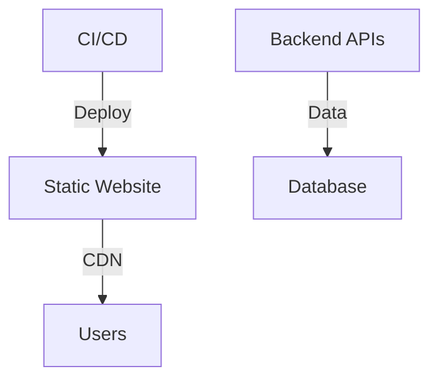
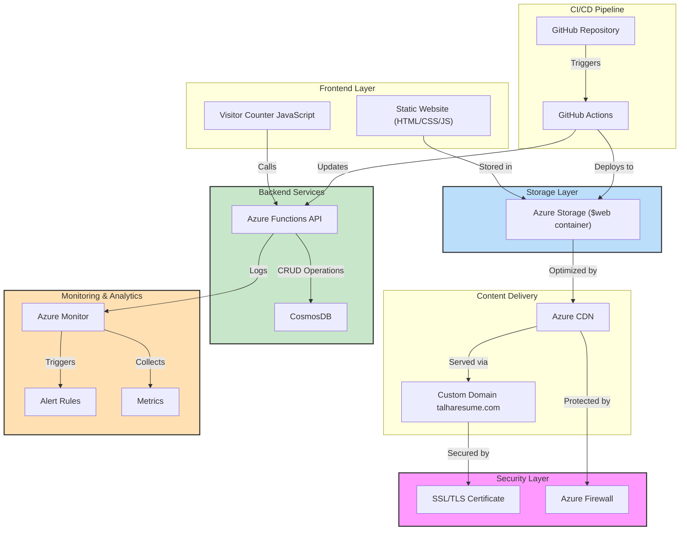
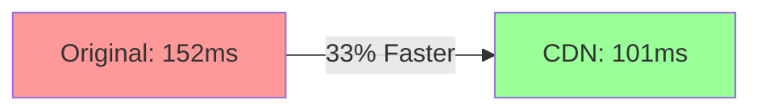

---
# Talha's Cloud Resume Challenge
[](#)
[](#)
[](#)
[](#)
## 🌐 Live Demo
Check out the live demo [here](http://www.talharesume.com).
## 📜 Overview
This project showcases a modern, serverless resume platform built using Azure services, infrastructure as code (IaC), and DevOps best practices. It demonstrates real-world cloud engineering skills by delivering a high-performance, secure, and scalable resume website.
## 📅 Implementation Timeline
- **2024-02-14**: Frontend deployment completed.
- **2024-02-15**: Started CosmosDB implementation.
- **2024-02-19**: Database connection implemented and tested.
- **2024-02-22**: Visitor counter implementation completed with local testing.
## 🏗️ Implementation Status
### Completed Components ✅
- **Frontend Infrastructure**: Azure Static Website Hosting with CDN and custom domain setup.
- **Database Setup**: CosmosDB instance with MongoDB API, serverless capacity mode, and security measures.
- **Visitor Counter**: Azure Function created with Python, integrated with CosmosDB, and locally tested.
### In Progress 🔄
- **Backend Development**: Enhancing visitor counter and Azure Functions API.
- **CI/CD Pipeline**: Developing GitHub Actions workflows for automated testing and deployment.
## 🗺️ System Architecture
### High-Level Overview

### Detailed Architecture

## 📊 Performance & Controls
### Key Metrics
- **Page Load Time**: 101ms (CDN-optimized)
- **Cache Hit Ratio**: >95%
- **Global Availability**: 99.99%
### CDN Performance Analysis

## 🛠️ Development Setup
### Quick Start
```bash
git clone https://github.com/saddavi/Talha-CloudResumeChallenge.git
cd Talha-CloudResumeChallenge
npm install
```
### Prerequisites
- **Azure CLI**
- **Node.js**
- **Git**
- **Visual Studio Code** (recommended)
### Project Structure
```plaintext
cloud-resume/
├── frontend/
│   ├── index.html          # Resume content
│   ├── css/
│   │   └── styles.css      # Styling
│   └── js/
│       └── counter.js      # Visitor counter
├── backend/
│   ├── api/               # Azure Functions
│   └── database/          # CosmosDB setup
├── infrastructure/
│   └── terraform/         # IaC templates
└── .github/
    └── workflows/         # CI/CD pipelines
```
## 🔒 Security Implementation
- **SSL/TLS Encryption**
- **Secured Storage Access**
- **Automated Security Updates**
- **Regular Security Audits**
## 📈 Future Enhancements
- **Performance Optimization**: Implement Azure Front Door, enable HTTP/3, and optimize asset delivery.
- **Security Enhancements**: Enhanced rate limiting, WAF protection, and automated security testing.
- **Feature Additions**: Blog integration, portfolio showcase, and interactive elements.
## 📚 Additional Resources
- [Azure Static Website Documentation](https://docs.microsoft.com/azure/storage/blobs/storage-blob-static-website)
- [Cloud Resume Challenge Guide](https://cloudresumechallenge.dev/)
- [Azure Architecture Center](https://docs.microsoft.com/azure/architecture/)
