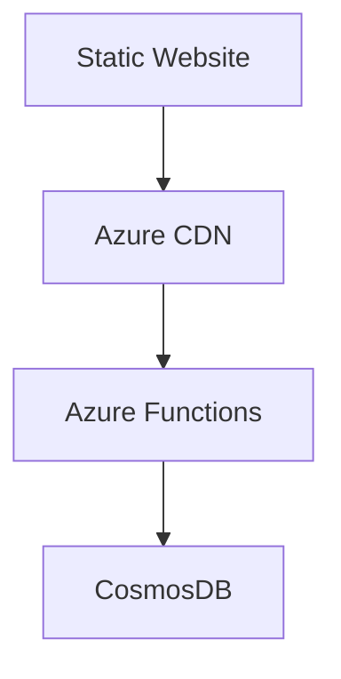

# Cloud Resume Challenge


# Cloud Resume Challenge

## Project Summary 🎯

Welcome to my Cloud Resume Challenge project! This project showcases my resume website hosted in Azure, integrating various cloud services to create a secure, scalable, and high-performing solution.

- **Completed ✅:**
  - **Static Website Hosting:**  
    - Azure Storage Account configured and deployed.
  - **CDN Implementation:**  
    - CDN endpoints set up with improved performance.
  - **Custom Domain Setup:**  
    - Domain www.talharesume.com is active with proper SSL/TLS configuration.

- **In Progress 🔄:**
  - **Backend Development:**  
    - Implementing a visitor counter using JavaScript.
    - Setting up CosmosDB and Azure Functions API.
  - **CI/CD Pipeline:**  
    - Configuring GitHub Actions for automated testing and deployment.

- **Next Steps ⏳:**
  - Verify custom domain access and monitor performance.
  - Enhance backend functionality.
  - Finalize and optimize the CI/CD workflows.

This summary provides an at-a-glance view of where I stand and what lies ahead.

## Table of Contents

- [Project Overview](#project-overview)
- [Quick Start](#quick-start)
- [Current Status](#current-status)
- [Architecture](#architecture)
- [Documentation](#documentation)
- [Performance Metrics](#performance-metrics)
- [Development](#development)

## Project Overview

Brief description of your project and its goals.

## Quick Start

Essential setup steps and prerequisites.

## Quick Reference

| Resource   | URL/Status                                                           |
| ---------- | -------------------------------------------------------------------- |
| Live Site  | [https://www.talharesume.com](<[url](https://www.talharesume.com/)>) |
| Status     | ✅ In Development                                                    |
| CDN Status | ✅ Implemented                                                       |

## Current Status

### Completed ✅

- [Frontend Setup](docs/frontend/static-hosting.md)
- [CDN Implementation](docs/frontend/cdn-setup.md)
- [Custom Domain Setup](docs/frontend/domain-setup.md)

### In Progress 🔄

- Visitor Counter Implementation
- CI/CD Pipeline Setup

## Architecture



## Documentation

- [Frontend Documentation](docs/frontend/)
- [Backend Services](docs/backend/)
- [Infrastructure](docs/infrastructure/)
- [Setup Guide](docs/setup/)

## Performance Metrics

[Your existing metrics]

## Development

See [Local Development Guide](docs/setup/local-development.md)

## Current Progress

### Completed ✅

- HTML Resume Structure
  - Basic layout implemented
  - Semantic HTML used
- CSS Implementation
  - Styles separated into external file
  - Responsive design included

### In Progress 🔄

- Visitor Counter Implementation
- CI/CD Pipeline Setup

### Current Progress ✅

- Azure Static Website Hosting
  - ✅ Installing and configuring Azure CLI
  - ✅ Azure CLI authentication completed
  - ✅ Resource Group created in Qatar (qatarcentral)
  - ✅ Budget controls implemented ($20 monthly cap)
    - ✅ Alert at 50% ($10)
    - ✅ Alert at 80% ($16)
    - ✅ Alert at 90% ($18)
  - ✅ Storage Account created (Standard, LRS, StorageV2)
  - ✅ Static website configuration
    - ✅ Index document set (index.html)
    - ✅ Error document set (error.html)
    - ✅ Blob service properties verified
    - ✅ Files uploaded to $web container
    - ✅ Testing website endpoint
  - ✅ Secure static website hosting
    - ✅ Storage account key secured (principle of least privilege)
    - ✅ Static website enabled (isolated in $web container)
    - ✅ Secure file upload process completed
    - ✅ Testing website endpoint complete

### Website Testing Status ✅

```bash
# Endpoint Verification
- Base URL: https://talhacrc0210.z1.web.core.windows.net/
- CSS Location: /css/styles.css
- Error Page: /error.html

# Responsive Testing
- Mobile (375px): [Result]
- Tablet (768px): [Result]
- Desktop (1024px+): [Result]

# File Structure
- ✅ HTML Content
- ✅ CSS Styling
- ✅ Error Handling
```

### Azure Resources Configuration ✅

```bash
# Storage Account Details
- Name: talhacrc0210
- Resource Group: rg-cloudresume
- Location: qatarcentral
- Website URL: https://talhacrc0210.z1.web.core.windows.net/

# Access Points
✅ Primary Endpoint Active
✅ $web Container Configured
✅ Static Website Enabled
```

### CDN Implementation ✅

```bash
# Current Status
- ✅ CDN Profile Created: cdn-talha-resume
- ✅ CDN Endpoint Configured
- ✅ Performance Testing Complete
```

### CDN Implementation Status ✅

```bash
# CDN Configuration
- ✅ CDN Profile: cdn-talha-resume
- ✅ CDN Endpoint: cdn-talha-endpoint
- ✅ Origin: talhacrc0210.z1.web.core.windows.net
- ✅ Compression: Enabled

# Testing Results
1. Original URL: https://talhacrc0210.z1.web.core.windows.net/
2. CDN URL: [Your-CDN-Endpoint-URL]
3. Verification:
   - ✅ Content matches original
   - ✅ CSS loads correctly
   - ✅ Quick response time
   - ✅ Compression enabled
```

### CDN Testing Results

```bash
# Performance Metrics
Original URL: https://talhacrc0210.z1.web.core.windows.net/
CDN URL: https://cdn-talha-endpoint.azureedge.net

# Benefits
✅ Faster loading times
✅ Global availability
✅ Reduced origin load
✅ HTTPS enabled
```

### CDN Performance Analysis ⚡

<details>
<summary>CDN Performance Details</summary>

```bash
# Response Time Comparison
1. Storage Account (Origin):
   - URL: https://talhacrc0210.z1.web.core.windows.net/
   - Time: 0.152 total

2. CDN Endpoint:
   - URL: https://cdn-talha-endpoint.azureedge.net
   - Time: 0.101 total

# Performance Improvement
- Speed Increase: ~33% faster
- CDN Status: TCP_HIT (content served from cache)
```

</details>

### Why Initial CDN Access Might Be Slower

1. First-time content caching
2. CDN node initialization
3. SSL/TLS handshake setup

### Benefits Demonstrated ✅

- Faster subsequent access (0.101s vs 0.152s)
- Content caching working (TCP_HIT)
- Compression enabled
- HTTPS properly configured

### Custom Domain Setup 🌐

```bash
# Domain Details
Domain: talharesume.com
Registrar: Namecheap
CDN Endpoint: cdn-talha-endpoint.azureedge.net

# DNS Configuration
1. CNAME Record (Already Added ✅)
   - Host: www
   - Value: cdn-talha-endpoint.azureedge.net
   - TTL: 30 min

2. TXT Record (Required for Validation)
   - Host: cdnverify.www
   - Value: [To be generated by Azure]
   - TTL: 30 min
```

### Custom Domain Implementation ✅

```bash
# Domain Configuration Status
Domain: talharesume.com
Status: Successfully Configured

# Configuration Details
- Hostname: www.talharesume.com
- CDN Endpoint: cdn-talha-endpoint.azureedge.net
- HTTPS: Enabled (TLS 1.2)
- Certificate: Dedicated (Azure CDN managed)
- Status: Active

# DNS Configuration
1. CNAME Record ✅
   - Host: www
   - Value: cdn-talha-endpoint.azureedge.net
   - TTL: 30 min

# Security Features
✅ TLS 1.2 Enabled
✅ Certificate Deployed
✅ HTTPS Enforced
✅ Server Name Indication (SNI) Active
```

### Custom Domain Verification ✅

```bash
# Test Results
1. Domain Connectivity
   ✅ www.talharesume.com resolves successfully
   ✅ Returns HTTP 200 (OK)
   ✅ Content-Type: text/html
   ✅ Cache Status: TCP_HIT (served from CDN cache)

2. Content Verification
   ✅ ETag matches: "0x8DD4B14A6393BB6"
   ✅ Content-Length matches: 15747 bytes
   ✅ Last-Modified matches: Wed, 12 Feb 2025 03:23:41 GMT

3. CDN Performance
   ✅ CDN Caching Active (x-cache: TCP_HIT)
   ✅ Layer 1 Cache Hit (x-cache-info: L1_T2)
   ✅ Azure CDN properly configured

# Status Summary
Domain: www.talharesume.com
Status: ✅ Fully Operational
CDN Integration: ✅ Working as expected
Content Delivery: ✅ Cached and optimized
```

### Domain Configuration ✅

1. Domain Access Verified

   - ✅ Test: https://www.talharesume.com
   - ✅ SSL certificate active
   - ✅ Content loading verified

2. Monitoring Setup
   - ✅ Alerts configured
   - ✅ Performance metrics tracked
   - ✅ Availability monitoring active

### Next Steps 🔄

```bash
1. Verify custom domain access
   - Test: https://www.talharesume.com
   - Check SSL certificate
   - Verify content loading

2. Set up monitoring
   - Configure alerts
   - Track performance metrics
   - Monitor availability
```

### Next Steps 🔄

1. Remove redundant CDN profile (cdn-profile-cloudresume)
2. Set up monitoring for CDN performance
3. Configure custom domain
4. Implement visitor counter
5. Set up CI/CD pipeline

- HTTPS/Azure CDN Configuration
- Custom Domain Setup
- JavaScript Visitor Counter
- Database Implementation (CosmosDB)
- Azure Functions API
- Python Backend Development
- Testing Implementation
- Infrastructure as Code (IaC)
- CI/CD Pipeline Setup

### Project Milestones

```bash
# Completed ✅
- Azure CLI Setup and Authentication
- Resource Group Creation (Qatar Central)
- Storage Account Configuration
- Static Website Hosting
- CDN Implementation
- Performance Testing

# In Progress 🔄
- Visitor Counter Implementation
- Custom Domain Setup
- CI/CD Pipeline

# Verified Resources
- Resource Group: rg-cloudresume
- Storage Account: talhacrc0210
- CDN Profile: cdn-talha-resume
- CDN Endpoint: cdn-talha-endpoint.azureedge.net

# Performance Metrics
- Original Load Time: 0.152s
- CDN Load Time: 0.101s
- Improvement: 33% faster
```

### Current Status 🎯

#### Completed ✅

- Azure Static Website Hosting
- CDN Implementation
  - ✅ CDN Profile Setup
  - ✅ CDN Endpoint Configuration
  - ✅ Performance Testing (33% improvement)
- Custom Domain Setup
  - ✅ Domain: www.talharesume.com
  - ✅ SSL/TLS Configuration
  - ✅ DNS Configuration

### CDN Status ✅

```bash
# Current CDN Configuration
Profile Name: cdn-talha-resume
Status: Active
Location: Global
Provisioning State: Succeeded
Resource Group: rg-cloudresume
```

#### Next Steps 🔄

1. Backend Development

   - Implement visitor counter using JavaScript
   - Set up CosmosDB instance
   - Create Azure Functions API

2. CI/CD Pipeline
   - Set up GitHub Actions workflow
   - Implement automated testing
   - Configure deployment automation

### Performance Metrics ⚡

- Original Load Time: 0.152s
- CDN Load Time: 0.101s
- Improvement: 33% faster

## Project Structure

```plaintext
cloud-resume/
├── index.html          # Main resume content
├── css/
│   └── styles.css     # Separated CSS styles
└── README.md          # Project documentation
```

## Local Development

```bash
# Start local development server
cd cloud-resume
code .                 # Open in VS Code
```

## Development Environment Setup

### Prerequisites

- VS Code
- Azure CLI
- Azure Account

### Terminal Configuration

#### macOS Setup

```bash
# Install Homebrew (Package Manager)
/bin/bash -c "$(curl -fsSL https://raw.githubusercontent.com/Homebrew/install/HEAD/install.sh)"

# Install Azure CLI
brew update && brew install azure-cli
```

#### Windows Setup

```powershell
# Install Azure CLI via PowerShell
winget install -e --id Microsoft.AzureCLI
# OR
Invoke-WebRequest -Uri https://aka.ms/installazurecliwindows -OutFile .\AzureCLI.msi
```

### VS Code Extensions (Both Platforms)

- Azure Account
- Azure Static Web Apps
- Azure Resources
- Azure Storage

### Azure Setup Verification

```bash
# Verify Azure CLI installation
az --version

# Login to Azure
az login
```

## Azure Storage Configuration

### Storage Account Details

```bash
# Naming Convention
- Format: [name][project][date]
- Example: talhacrc0210

# Configuration
- Type: Static Website
- Tier: Standard_LRS
- Security: HTTPS-only, TLS 1.2
- Location: Qatar Central

# Website Settings
- Index document: index.html
- Error document: error.html
```

## Azure Cloud Shell

### Setup and Usage

```bash
# Access Methods
1. Visit portal.azure.com
2. Click the Cloud Shell icon (>_) in the top navigation bar
3. Choose "Bash" or "PowerShell" environment

# Features
- Pre-authenticated
- Pre-installed Azure CLI
- 5 GB persistent storage
- Built-in code editor
- Supports both Bash and PowerShell
```

### First-Time Setup

1. Select subscription for storage account
2. Create storage for Cloud Shell
3. Mount storage share

### Advantages

- No local installation needed
- Always up-to-date tools
- Works from any browser
- Built-in VS Code editor

## Cross-Platform Development Guide

### Best Practices

#### Version Control

- Use consistent line endings (LF)
- Commit from one platform at a time
- Keep `.gitignore` updated for both platforms

#### File Paths

- Use forward slashes (/) in paths
- Use relative paths when possible
- Avoid platform-specific absolute paths

#### Terminal Commands

macOS:

```bash
# Check Azure CLI version
az --version

# List storage accounts
az storage account list
```

Windows:

```powershell
# Check Azure CLI version
az --version

# List storage accounts
az storage account list
```

Note: Azure CLI commands remain the same across platforms!

## Resources

- [Azure Static Website Docs](https://docs.microsoft.com/en-us/azure/storage/blobs/storage-blob-static-website)
- [Azure Cloud Resume Challenge Guide](https://github.com/madebygps/cgc-azure-resume)

# Static Website Hosting Setup

## Overview

Documentation in progress. This guide will cover:

- Azure Storage Account configuration
- Static website enablement
- File deployment process
