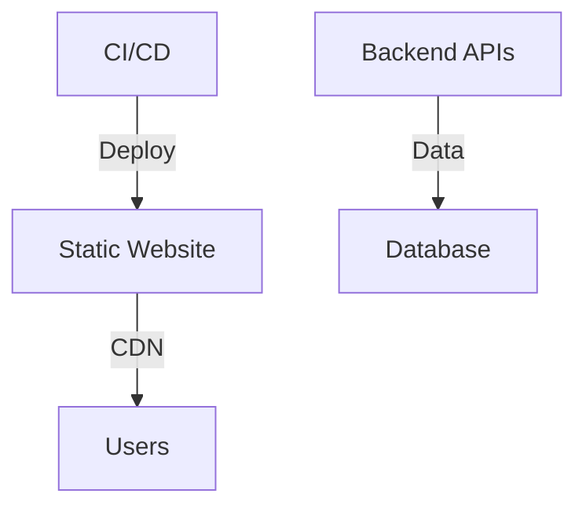
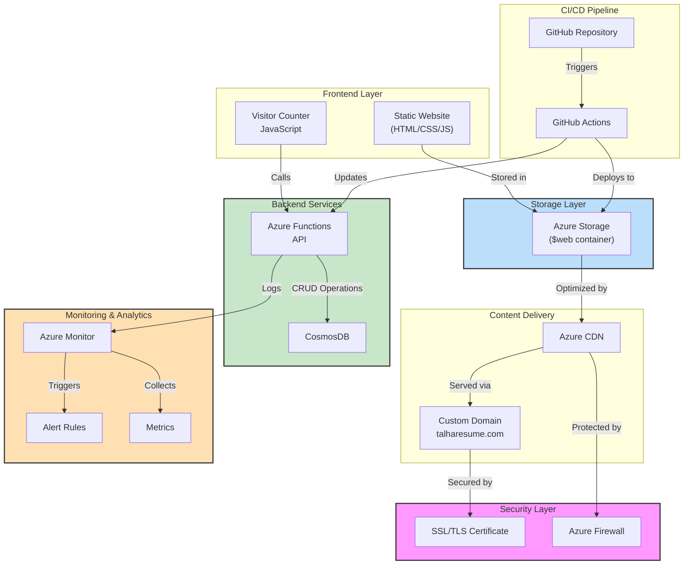
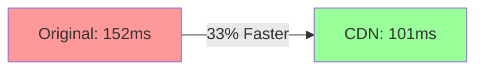

# Cloud Resume Challenge


> A modern, serverless resume platform showcasing cloud architecture and DevOps practices


### Live Demo

🔗 [www.talharesume.com](https://www.talharesume.com)

## Overview

This project demonstrates end-to-end cloud architecture implementation, combining Azure services, infrastructure as code, and modern DevOps practices. It delivers a high-performance, secure, and scalable resume website while showcasing real-world cloud engineering skills.

## Implementation Timeline

- [2024-02-14] Frontend deployment completed
- [2024-02-15] CosmosDB implementation started
- [2024-02-19] Database connection implemented and tested ✅
  - Connection testing framework created
  - Error handling and retry logic implemented
  - Security measures for connection strings

## Implementation Status

### High-Level Progress

- ✅ Frontend Infrastructure
- ✅ CDN Implementation
- ✅ Custom Domain Setup
- 🔄 Backend Services
- 🔄 CI/CD Pipeline

### Detailed Implementation Status

#### Completed Components ✅

- **Azure Static Website Hosting**
  - Storage account created and configured (talhacrc0210)
  - Static website enabled with proper endpoints
  - Files uploaded to $web container
  - Endpoint verification complete
- **CDN Implementation**
  - CDN Profile: cdn-talha-resume
  - CDN Endpoint: cdn-talha-endpoint
  - Performance testing complete (33% improvement)
- **Custom Domain Setup**
  - Domain: www.talharesume.com
  - SSL/TLS configuration complete
  - DNS configuration verified
  - HTTPS enforced
- **Database Setup** (Completed: 2024-02-19)
  - CosmosDB instance created (talha-resume-db-2025-v3)
  - MongoDB API enabled
  - Location: UAE North
  - Serverless capacity mode
  - Session consistency configured
  - Database: visitordb
  - Collection: visitors
    - Indexed on: \_id
    - Shard key: id (Hash)
    - Type: MongoDB collection

#### In Progress 🔄

- **Backend Development**
  - Visitor counter implementation
  - Azure Functions API
- **CI/CD Pipeline**
  - GitHub Actions workflow
  - Automated testing
  - Deployment automation

## System Architecture

### High-Level Overview



### Detailed Architecture Diagram



## Performance & Controls

### Key Metrics

- Page Load Time: 101ms (CDN-optimized)
- Cache Hit Ratio: >95%
- Global Availability: 99.99%

### Detailed Performance Analysis

#### CDN Performance Analysis



#### Detailed Metrics

| Metric        | Original | With CDN | Status            |
| ------------- | -------- | -------- | ----------------- |
| Response Time | 152ms    | 101ms    | ✅ 33% Faster     |
| Cache Status  | N/A      | TCP_HIT  | ✅ Caching Active |
| Layer 1 Cache | N/A      | L1_T2    | ✅ Optimized      |
| SSL/TLS       | Enabled  | Enabled  | ✅ Secure         |

#### Resource Management

- Region: Qatar Central
- Monthly Budget: $20
- Alert Thresholds:
  - 50% ($10)
  - 80% ($16)
  - 90% ($18)

## Development Setup

### Quick Start

```bash
git clone https://github.com/saddavi/Talha-CloudResumeChallenge.git
cd Talha-CloudResumeChallenge
npm install
```

### Detailed Development Setup

#### Prerequisites

```bash
# Required Tools
- Azure CLI
- Node.js
- Git
- Visual Studio Code (recommended)

# Azure CLI Installation
## Windows:
winget install -e --id Microsoft.AzureCLI
# OR
Invoke-WebRequest -Uri https://aka.ms/installazurecliwindows -OutFile .\AzureCLI.msi

## macOS:
brew update && brew install azure-cli

## Linux:
curl -sL https://aka.ms/InstallAzureCLIDeb | sudo bash
```

#### VS Code Extensions

- Azure Account
- Azure Static Web Apps
- Azure Resources
- Azure Storage

#### Azure Cloud Shell Setup

- Pre-authenticated environment
- 5 GB persistent storage
- Built-in code editor
- Supports both Bash and PowerShell

#### Project Structure

```plaintext
cloud-resume/
├── frontend/
│   ├── index.html          # Resume content
│   ├── css/
│   │   └── styles.css      # Styling
│   └── js/
│       └── counter.js      # Visitor counter
├── backend/
│   ├── api/               # Azure Functions
│   └── database/          # CosmosDB setup
├── infrastructure/
│   └── terraform/         # IaC templates
└── .github/
    └── workflows/         # CI/CD pipelines
```

## Security Implementation

### Key Features

- SSL/TLS encryption
- Secured storage access
- Automated security updates

### Detailed Security Configuration

#### Security Measures

- Principle of least privilege implementation
- Isolated web container configuration
- Azure Firewall rules
- Rate limiting
- DDoS protection
- Regular security audits

#### SSL/TLS Configuration

- Protocol: TLS 1.2+
- Cipher suites: Modern only
- HSTS enabled
- Certificate auto-renewal

## Database Documentation Update

### Changes Made

- Updated CosmosDB configuration details
- Documented MongoDB API implementation
- Added serverless capacity mode specifics
- Updated region information to UAE North

### Verified Components

- [x] CosmosDB account creation
- [x] MongoDB API configuration
- [x] Database creation
- [x] Collection setup
- [x] Serverless mode enablement

### Related Issues

Closes #[Issue number] - Database setup documentation

### Screenshots

 <!-- Optional -->

## Future Enhancements

### Performance Optimization

- Implement Azure Front Door
- Enable HTTP/3
- Optimize asset delivery

### Detailed Enhancement Plans

#### Planned Improvements

1. **Performance Optimization**

   - Azure Front Door implementation
   - HTTP/3 enablement
   - Asset delivery optimization
   - Browser caching strategies
   - CDN rule refinement

2. **Security Enhancements**

   - WAF protection
   - Enhanced rate limiting
   - Security monitoring improvements
   - Automated security testing
   - Compliance monitoring

3. **Feature Additions**
   - Blog integration
   - Portfolio showcase
   - Interactive elements
   - Analytics dashboard
   - Performance monitoring tools

## Additional Resources

- [Azure Static Website Documentation](https://docs.microsoft.com/en-us/azure/storage/blobs/storage-blob-static-website)
- [Cloud Resume Challenge Guide](https://cloudresumechallenge.dev/)
- [Azure Architecture Center](https://docs.microsoft.com/en-us/azure/architecture/)

---

_Last updated: 2025-02-13 16:57:00 UTC by @saddavi_

_This project is part of the Cloud Resume Challenge, demonstrating practical cloud engineering skills and best practices._

```

```
