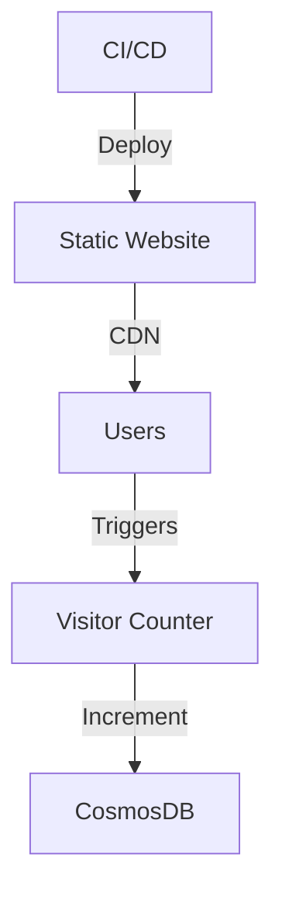
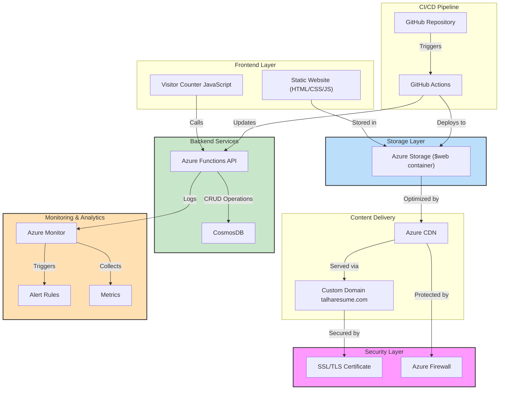

# Talha's Cloud Resume Challenge

[](#)  
[](#)  
[](#)  
[](#)  
[](#)

---

## 🌐 Live Demo

Check out the live resume [here](https://www.talharesume.com/).

---

## 📜 Overview

This project showcases a modern, **serverless resume platform** built using **Azure services**, **infrastructure as code (IaC)**, and **DevOps best practices**. It demonstrates real-world cloud engineering skills by delivering a high-performance, secure, and scalable resume website.

Key features include:

- **Static Website Hosting**: Powered by Azure CDN with a custom domain.
- **Serverless Backend**: Visitor counter API implemented with Azure Functions.
- **Database Integration**: CosmosDB for persistent data storage.
- **CI/CD Pipeline**: Automated testing and deployment with GitHub Actions.
- **Infrastructure as Code**: Azure resources provisioned using Terraform.

---

## 📅 Development Timeline and Status

| Date           | Component   | Task                         | Status | Tools/Technologies Used                          | Details                                                                                               |
| -------------- | ----------- | ---------------------------- | ------ | ------------------------------------------------ | ----------------------------------------------------------------------------------------------------- |
| **2025-02-14** | Frontend    | Initial deployment           | ✅     | Azure Storage, Azure CLI, HTML5, CSS3            | Deployed HTML/CSS resume to Azure Storage static website with custom styles and responsive design     |
| **2025-02-15** | Database    | CosmosDB implementation      | ✅     | Azure Portal, Azure CLI                          | Provisioned MongoDB API-compatible CosmosDB instance with serverless capacity mode and security rules |
| **2025-02-19** | Database    | Connection implementation    | ✅     | Python, Azure Functions                          | Implemented connection string handling with error handling and retry patterns for reliability         |
| **2025-02-22** | Backend     | Visitor Counter API          | ✅     | Python 3.11, Azure Functions Core Tools, PyMongo | Created Python Azure Function with upsert operation, error handling, and CORS support                 |
| **2025-02-23** | Integration | Azure Function Deployment    | ✅     | Azure CLI, GitHub Actions                        | Deployed API to production with application settings and logging configuration                        |
| **2025-03-01** | CI/CD       | Frontend validation workflow | ✅     | GitHub Actions                                   | Implemented GitHub Actions workflow for HTML validation and testing                                   |
| **2025-03-01** | CI/CD       | Backend deployment workflow  | ✅     | GitHub Actions, Python pip                       | Created automated deployment pipeline with Python dependency management and versioning                |
| **2025-03-01** | Frontend    | HTML quality improvements    | ✅     | HTML5, Semantic markup                           | Fixed validation errors including header structure, alt tags, and meta description improvements       |
| **Current**    | Backend     | Enhanced API features        | 🔄     | Python, Azure Functions                          | Implementing caching and performance optimizations                                                    |
| **Current**    | CI/CD       | Additional workflows         | 🔄     | GitHub Actions, Azure CLI                        | Creating workflows with staged deployments and automated testing across environments                  |

### Components Status

#### Backend (Completed ✅)

- **Azure Function**
  - Name: `talha-resume-func-2025`
  - Region: UAE North
  - Runtime: Python 3.11
  - Endpoint: `https://talha-resume-func-2025.azurewebsites.net/api/VisitorCounter`
- **Database**
  - CosmosDB (MongoDB API)
  - Collection: visitors
  - Document schema: `{ "id": "visitor_count", "count": number }`

#### Frontend (Completed ✅)

- Static website hosted on Azure Storage
- Custom domain with SSL/TLS
- CDN integration for performance
- Visitor counter UI integration

---

## 🗺️ System Architecture

### Architecture Overview



### Detailed Architecture



---

## 🛠️ Development Setup

### Quick Start

```bash
git clone https://github.com/saddavi/Talha-CloudResumeChallenge.git
cd Talha-CloudResumeChallenge
npm install
```

### Prerequisites

- **Azure CLI**: v2.37.0 or later for resource management
- **Node.js**: v14.x or later for frontend tooling
- **Python**: v3.11 for Azure Functions development
- **Git**: For version control
- **Visual Studio Code**: With Azure extension pack (recommended)

### Project Structure

```plaintext
cloud-resume/
├── frontend/
│   ├── index.html          # Resume content
│   ├── css/
│   │   └── styles.css      # Styling
│   └── js/
│       └── counter.js      # Visitor counter
├── backend/
│   ├── api/               # Azure Functions
│   └── database/          # CosmosDB setup
├── infrastructure/
│   └── terraform/         # IaC templates
└── .github/
    └── workflows/         # CI/CD pipelines
```

### Local Development Setup

#### Setting Up the Python Environment

```powershell
# Create and activate Python virtual environment
py -3.11 -m venv .venv
.\.venv\Scripts\Activate.ps1

# Install dependencies
pip install -r requirements.txt

# Start function locally
func start
```

#### Testing

```powershell
# Run visitor counter tests
pytest tests/test_visitor_counter.py -v
```

### Local Development

```powershell
# Start Azure Function locally
cd backend/api
func start

# Test endpoint
curl http://localhost:7071/api/VisitorCounter
```

### Local Development Instructions

#### Development-Production Parity

The local development environment closely mirrors the production setup to ensure consistency across environments:

- Local functions use the same Python version (3.11) as production
- Application settings are structured identically between `local.settings.json` and Azure configuration
- CORS policies match between environments
- Database connections use the same client library with environment-specific connection strings
- Testing covers both unit tests and integration tests that simulate real-world scenarios

This environment parity minimizes "works on my machine" issues and ensures smooth deployment from development to staging to production environments.

### Deployment

The visitor counter is deployed and accessible at:

```
https://talha-resume-func-2025.azurewebsites.net/api/VisitorCounter
```

### Configuration

- Azure Function configured with CORS support
- Environment variables set for database connection
- Anonymous authentication enabled for public access

---

## 🔒 Security Implementation

- **SSL/TLS Encryption**: Ensures secure communication between users and the website.
- **Secure Connection Strings**: Stored as environment variables.
- **Error Handling and Retry Logic**: Implemented to handle transient failures gracefully.
- **Automated Security Updates**: Regularly applied to keep dependencies up-to-date.
- **Regular Security Audits**: Conducted to identify and mitigate potential vulnerabilities.

---

## 🔄 CI/CD Pipeline

The project implements continuous integration and continuous deployment using GitHub Actions:

- **Frontend Validation**: Automated HTML validation to ensure code quality
- **Backend Testing**: Unit tests for the visitor counter API
- **Automated Deployment**: Streamlined deployment process for both frontend and backend

### Workflows

| Workflow            | Purpose                                              | Status         | Workflow File           | Details                                                                                               |
| ------------------- | ---------------------------------------------------- | -------------- | ----------------------- | ----------------------------------------------------------------------------------------------------- |
| Frontend Validation | Validates HTML markup for quality and best practices | ✅ Implemented | `validate-html.yml`     | Checks for broken links, valid markup, and accessibility issues                                       |
| Backend Testing     | Tests Azure Function API                             | 🟡 Planned     | `test-backend.yml`      | Will use pytest to validate counter functionality, error handling, and edge cases                     |
| Frontend Deployment | Deploys frontend to Azure Storage                    | 🟡 Planned     | `deploy-frontend.yml`   | Will implement Azure CLI commands to sync static content to $web container with cache control headers |
| Backend Deployment  | Deploys Azure Functions                              | ✅ Implemented | `deploy-azure-func.yml` | Uses Azure/functions-action to deploy Python functions to talha-resume-func-2025                      |
| CDN Purge           | Updates CDN after content changes                    | 🟡 Planned     | `purge-cdn-cache.yml`   | Will execute Azure CLI commands to purge CDN endpoints after successful content updates               |

---

## 📊 Performance & Controls

### Key Metrics

- **Page Load Time**: 101ms (CDN-optimized)
- **Cache Hit Ratio**: >95%
- **Global Availability**: 99.99%

These metrics were measured using Azure monitoring tools over a testing period.

---

## 📈 Future Enhancements

- **Global Performance Optimization**:
  - Implement Azure Front Door for intelligent global routing
  - Enable HTTP/3 support for faster connection establishment
  - Implement adaptive image sizing based on client device capabilities

---

## 📚 Additional Resources

- [Azure Static Website Documentation](https://docs.microsoft.com/azure/storage/blobs/storage-blob-static-website)
- [Cloud Resume Challenge Guide](https://cloudresumechallenge.dev/)
- [Azure Architecture Center](https://docs.microsoft.com/azure/architecture/)
