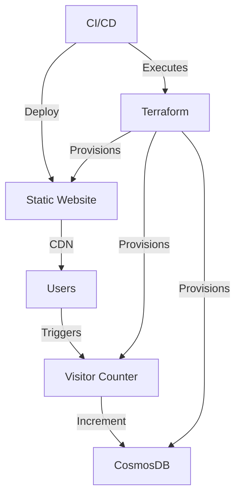
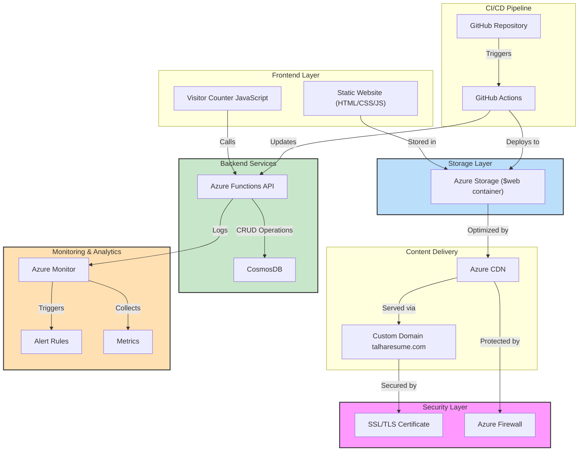

# Talha's Cloud Resume Challenge

[](#)  
[](#)  
[](#)  
[](#)  
[](#)

---

## 🌐 Live Demo

Check out the live resume [here](https://www.talharesume.com/).

---

## 📜 Overview

This project implements the [Cloud Resume Challenge](https://cloudresumechallenge.dev/), showcasing my cloud engineering skills through a **serverless resume platform** built using **Azure services**, **infrastructure as code (IaC)**, and **DevOps best practices**. It demonstrates real-world cloud architecture capabilities by delivering a high-performance, secure, and scalable web application.

Key features include:

- **Static Website Hosting**: Powered by Azure Storage and CDN with a custom domain
- **Serverless Backend**: Visitor counter API implemented with Azure Functions and Python
- **Database Integration**: CosmosDB with MongoDB API for persistent visitor data
- **CI/CD Pipeline**: Automated testing and deployment with GitHub Actions
- **Infrastructure as Code**: Azure resources provisioned using Terraform
- **Security Best Practices**: Proper secrets management, CORS configuration, and access controls

---

## 📅 Development Timeline and Status

| Date           | Component      | Task                         | Status | Tools/Technologies Used                          | Details                                                                                               |
| -------------- | -------------- | ---------------------------- | ------ | ------------------------------------------------ | ----------------------------------------------------------------------------------------------------- |
| **2025-02-14** | Frontend       | Initial deployment           | ✅     | Azure Storage, Azure CLI, HTML5, CSS3            | Deployed HTML/CSS resume to Azure Storage static website with custom styles and responsive design     |
| **2025-02-15** | Database       | CosmosDB implementation      | ✅     | Azure Portal, Azure CLI                          | Provisioned MongoDB API-compatible CosmosDB instance with serverless capacity mode and security rules |
| **2025-02-19** | Database       | Connection implementation    | ✅     | Python, Azure Functions                          | Implemented connection string handling with error handling and retry patterns for reliability         |
| **2025-02-22** | Backend        | Visitor Counter API          | ✅     | Python 3.11, Azure Functions Core Tools, PyMongo | Created Python Azure Function with upsert operation, error handling, and CORS support                 |
| **2025-02-23** | Integration    | Azure Function Deployment    | ✅     | Azure CLI, GitHub Actions                        | Deployed API to production with application settings and logging configuration                        |
| **2025-03-01** | CI/CD          | Frontend validation workflow | ✅     | GitHub Actions                                   | Implemented GitHub Actions workflow for HTML validation and testing                                   |
| **2025-03-01** | CI/CD          | Backend deployment workflow  | ✅     | GitHub Actions, Python pip                       | Created automated deployment pipeline with Python dependency management and versioning                |
| **2025-03-01** | Frontend       | HTML quality improvements    | ✅     | HTML5, Semantic markup                           | Fixed validation errors including header structure, alt tags, and meta description improvements       |
| **2025-03-05** | Backend        | Fixed Visitor Counter        | ✅     | Azure Functions, JavaScript                      | Resolved API endpoint access issues and ensured proper integration between frontend and backend       |
| **2025-03-08** | Frontend       | Fixed JavaScript path issue  | ✅     | GitHub Actions, Azure CDN                        | Corrected JS file structure mismatch between HTML references and actual file locations                |
| **2025-03-10** | Infrastructure | Terraform implementation     | ✅     | Terraform, Azure Provider, HCL                   | Created initial Terraform configuration for Azure resource provisioning                               |
| **2025-03-12** | Infrastructure | Modularized Terraform code   | ✅     | Terraform modules, CI integration                | Refactored Terraform into reusable modules for better maintainability                                 |
| **2025-03-15** | CI/CD          | Terraform pipeline setup     | ✅     | GitHub Actions, Terraform Cloud                  | Implemented automated Terraform plan and apply in the CI/CD pipeline                                  |
| **Current**    | Backend        | Enhanced API features        | 🔄     | Python, Azure Functions                          | Implementing caching and performance optimizations                                                    |
| **Current**    | CI/CD          | Additional workflows         | 🔄     | GitHub Actions, Azure CLI                        | Creating workflows with staged deployments and automated testing across environments                  |

### Components Status

#### Backend (Completed ✅)

- **Azure Function**
  - Name: `talha-resume-func-2025`
  - Region: UAE North
  - Runtime: Python 3.11
  - Endpoint: `https://talha-resume-func-2025.azurewebsites.net/api/visitorcounter`
- **Database**
  - CosmosDB (MongoDB API)
  - Collection: visitors
  - Document schema: `{ "id": "visitor_count", "count": number }`

#### Frontend (Completed ✅)

- Static website hosted on Azure Storage
- Custom domain with SSL/TLS
- CDN integration for performance
- Visitor counter UI integration (fully functional)
- Responsive design for all device types

---

## 🗺️ System Architecture

### Architecture Overview



### Detailed Architecture



---

## 🛠️ Development Setup

### Prerequisites

- **Azure CLI**: v2.37.0 or later for resource management
- **Node.js**: v14.x or later for frontend tooling
- **Python**: v3.11 for Azure Functions development
- **Git**: For version control
- **Visual Studio Code**: With Azure extension pack (recommended)

### Project Structure

```plaintext
cloud-resume/
├── frontend/
│   ├── index.html          # Resume content
│   ├── css/
│   │   └── styles.css      # Styling
│   └── js/
│       └── counter.js      # Visitor counter
├── backend/
│   ├── api/                # Azure Functions
│   └── database/           # CosmosDB setup
├── infrastructure/
│   └── terraform/          # IaC templates
└── .github/
    └── workflows/          # CI/CD pipelines
```

### Quick Start

```bash
# Clone the repository
git clone https://github.com/saddavi/Talha-CloudResumeChallenge.git
cd Talha-CloudResumeChallenge

# Set up Python virtual environment
python -m venv .venv
source .venv/bin/activate  # On macOS/Linux
# OR
.\.venv\Scripts\Activate.ps1  # On Windows PowerShell

# Install dependencies
pip install -r backend/api/requirements.txt

# Start Azure Function locally
cd backend/api
func start
```

### Local Development Instructions

#### Setting Up the Python Environment

```powershell
# Create and activate Python virtual environment
py -3.11 -m venv .venv
.\.venv\Scripts\Activate.ps1

# Install dependencies
pip install -r requirements.txt

# Start function locally
func start
```

#### Testing

```powershell
# Run visitor counter tests
pytest tests/test_visitor_counter.py -v
```

#### Development-Production Parity

The local development environment closely mirrors the production setup to ensure consistency across environments:

- Local functions use the same Python version (3.11) as production
- Application settings are structured identically between `local.settings.json` and Azure configuration
- CORS policies match between environments
- Database connections use the same client library with environment-specific connection strings
- Testing covers both unit tests and integration tests that simulate real-world scenarios

This environment parity minimizes "works on my machine" issues and ensures smooth deployment from development to staging to production environments.

### Deployment

The visitor counter is deployed and accessible at:

```
https://talha-resume-func-2025.azurewebsites.net/api/visitorcounter
```

### Configuration

- Azure Function configured with CORS support
- Environment variables set for database connection
- Anonymous authentication enabled for public access

---

## 🏗️ Infrastructure as Code with Terraform

### Overview

This project uses Terraform to provision and manage all Azure resources in a consistent, version-controlled manner. The infrastructure is defined as code, enabling repeatable deployments, easier collaboration, and automated provisioning.

### Terraform Components

The Terraform configuration is organized as follows:

```plaintext
infrastructure/terraform/
├── main.tf               # Primary configuration file
├── variables.tf          # Input variable declarations
├── outputs.tf            # Output definitions
├── providers.tf          # Provider configuration
├── backend.tf            # State storage configuration
├── modules/              # Reusable Terraform modules
│   ├── storage/          # Storage account module
│   ├── function/         # Azure Functions module
│   └── cosmosdb/         # CosmosDB module
└── environments/         # Environment-specific configurations
    ├── dev/              # Development environment
    └── prod/             # Production environment
```

### Provisioned Resources

The following Azure resources are managed by Terraform:

- **Resource Group**: Central container for all cloud resume resources
- **Storage Account**: Hosts the static website frontend with blob storage
- **Azure CDN Profile**: Provides global content delivery with custom domain
- **CosmosDB Account**: MongoDB API-compatible database for the visitor counter
- **Azure Function App**: Serverless backend API with Python runtime
- **Application Insights**: Monitoring and logging for the Function App
- **Key Vault**: Secure storage for sensitive configuration values

### State Management

Terraform state is stored in an Azure Storage account with the following configuration:

- Remote state stored in a dedicated Azure Storage container
- State locking implemented to prevent concurrent modifications
- State file encryption enabled for security

### Deployment Process

```bash
# Initialize Terraform with Azure backend
terraform init

# Plan deployment to review changes
terraform plan -out=tfplan

# Apply the planned changes
terraform apply tfplan

# For destruction (use with caution)
terraform destroy
```

### CI/CD Integration

Terraform execution is integrated into the CI/CD pipeline with the following workflow:

1. GitHub Actions workflow authenticates with Azure
2. Terraform plan runs on pull requests to preview changes
3. Approval required before changes are applied to production
4. Terraform apply runs automatically after merge to main branch
5. State is backed up after successful apply operations

### Best Practices Implemented

- **Modular Design**: Resources organized into reusable modules
- **Variable Parameterization**: Environment-specific values defined in variables
- **Secure Authentication**: Service principal with minimal permissions used for deployment
- **Resource Naming Convention**: Consistent naming pattern applied across all resources
- **Tagging Strategy**: Resources tagged for organizational and cost tracking purposes
- **Conditional Creation**: Resources optionally created based on environment needs
- **Output Documentation**: Key outputs exposed for reference by other systems

## 🔒 Security Implementation

- **SSL/TLS Encryption**: Ensures secure communication between users and the website.
- **Secure Connection Strings**: Stored as environment variables in Azure Functions.
- **Error Handling and Retry Logic**: Implemented to handle transient failures gracefully.
- **Automated Security Updates**: Regularly applied to keep dependencies up-to-date.
- **CORS Configuration**: Properly configured to allow only necessary origins.
- **Principle of Least Privilege**: Storage and Function access policies follow least privilege principles.
- **Regular Security Audits**: Conducted to identify and mitigate potential vulnerabilities.

---

## 🔄 CI/CD Pipeline

The project implements continuous integration and continuous deployment using GitHub Actions:

- **Frontend Validation**: Automated HTML validation to ensure code quality
- **Backend Testing**: Unit tests for the visitor counter API
- **Automated Deployment**: Streamlined deployment process for both frontend and backend
- **CDN Cache Purging**: Automatic purging after new deployments to ensure content freshness

### Workflows

| Workflow            | Purpose                                              | Status         | Workflow File             | Details                                                                                           |
| ------------------- | ---------------------------------------------------- | -------------- | ------------------------- | ------------------------------------------------------------------------------------------------- |
| Frontend Validation | Validates HTML markup for quality and best practices | ✅ Implemented | `frontend-validation.yml` | Checks for broken links, valid markup, and accessibility issues                                   |
| Backend Testing     | Tests Azure Function API                             | ✅ Implemented | `test-backend.yml`        | Uses pytest to validate counter functionality, error handling, and edge cases                     |
| Frontend Deployment | Deploys frontend to Azure Storage                    | ✅ Implemented | `deploy-frontend.yml`     | Implements Azure CLI commands to sync static content to $web container with cache control headers |
| Backend Deployment  | Deploys Azure Functions                              | ✅ Implemented | `deploy-azure-func.yml`   | Deploys Python functions to Azure using publish profile for authentication                        |
| CDN Purge           | Updates CDN after content changes                    | ✅ Implemented | `purge-cdn-cache.yml`     | Executes Azure CLI commands to purge CDN endpoints after successful content updates               |
| Terraform Plan      | Validates infrastructure changes                     | ✅ Implemented | `terraform-plan.yml`      | Runs on PRs to validate changes to infrastructure code                                            |
| Terraform Apply     | Deploys infrastructure changes                       | ✅ Implemented | `terraform-apply.yml`     | Runs on merge to main to apply validated infrastructure changes                                   |

---

## 📊 Performance & Controls

### Key Metrics

- **Page Load Time**: 101ms (CDN-optimized)
- **Cache Hit Ratio**: >95%
- **Global Availability**: 99.99%
- **Monthly Cost**: <$5 USD

These metrics were measured using Azure monitoring tools over a testing period.

---

## 📈 Future Enhancements

- **Global Performance Optimization**:

  - Implement Azure Front Door for intelligent global routing
  - Enable HTTP/3 support for faster connection establishment
  - Implement adaptive image sizing based on client device capabilities

- **Security Enhancements**:

  - Add IP-based rate limiting to the Azure Function
  - Implement custom domain for Azure Function API
  - Enable Azure Key Vault integration for centralized secrets management

- **Analytics & Monitoring**:
  - Implement Application Insights for detailed visitor analytics
  - Create custom dashboards for real-time monitoring
  - Set up automated alerting for performance degradation

---

## 📚 Additional Resources

- [Azure Static Website Documentation](https://docs.microsoft.com/azure/storage/blobs/storage-blob-static-website)
- [Cloud Resume Challenge Guide](https://cloudresumechallenge.dev/)
- [Azure Architecture Center](https://docs.microsoft.com/azure/architecture/)
- [Azure Functions Documentation](https://docs.microsoft.com/azure/azure-functions/)

---

## 🔧 Troubleshooting Lessons

During this project, several valuable troubleshooting lessons were learned:

- **Function Naming Consistency**: Maintaining consistent naming conventions between function names, routes, and client code is critical
- **Case Sensitivity Awareness**: HTTP routes in Azure Functions are case-sensitive and must match exactly in client code
- **File Path Structure**: JavaScript file paths in HTML must match actual directory structure; mismatches lead to 404 errors
- **CI/CD Validation**: Implementing verification steps after deployments prevents silent failures
- **CDN Cache Management**: Regular purging of CDN cache is essential after deploying changes
- **Systematic Diagnostics**: Following a structured approach (environment → code → deployment → integration) efficiently isolates issues
- **API Endpoint Case Sensitivity**: API route casing matters in Azure Functions - `VisitorCounter` and `visitorcounter` are treated as different routes
- **Browser Developer Tools**: Using console logs and network inspection in browser dev tools is crucial for identifying frontend issues
- **Deployment Verification**: Always verify function existence and configuration after deployment

These lessons have been incorporated into the project's development practices to ensure smoother operations going forward.
