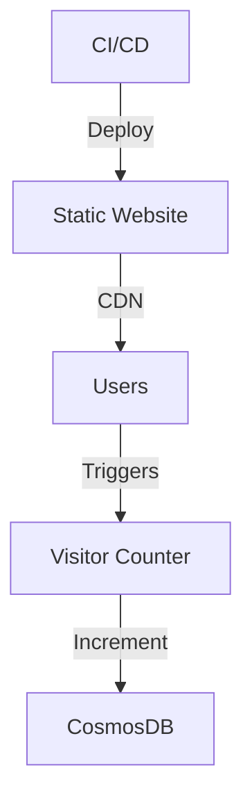
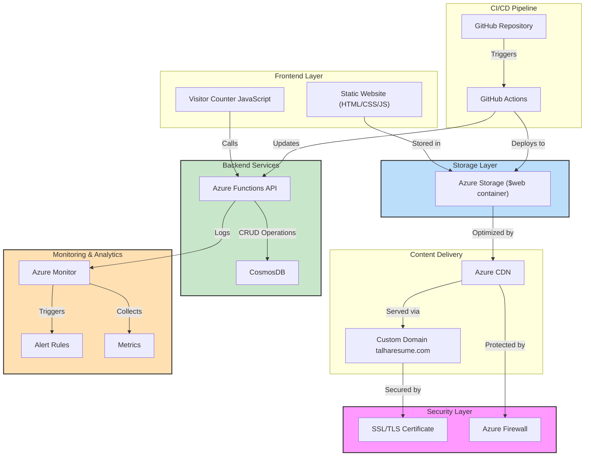
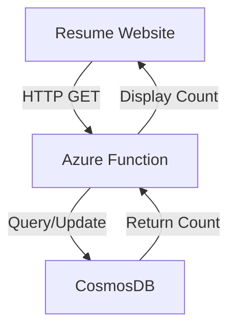
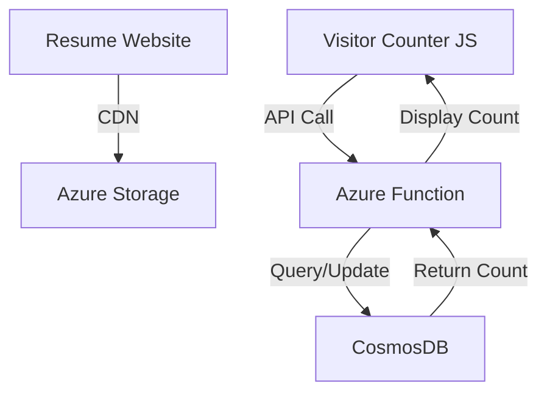
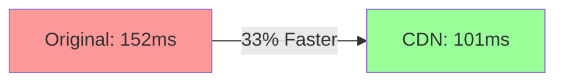

# Talha's Cloud Resume Challenge

[](#)  
[](#)  
[](#)  
[](#)

---

## 🌐 Live Demo

Check out the live demo [here](http://www.talharesume.com).

---

## 📜 Overview

This project showcases a modern, **serverless resume platform** built using **Azure services**, **infrastructure as code (IaC)**, and **DevOps best practices**. It demonstrates real-world cloud engineering skills by delivering a high-performance, secure, and scalable resume website.

Key features include:

- **Static Website Hosting**: Powered by Azure CDN with a custom domain.
- **Visitor Counter**: Integrated with CosmosDB and Azure Functions.
- **CI/CD Pipeline**: Automated workflows for seamless updates (in progress).

---

## 📅 Implementation Timeline

- [2024-02-14]: Frontend deployment completed.
- [2024-02-15]: CosmosDB implementation started.
- [2024-02-19]: Database connection implemented and tested ✅
  - Created a connection testing framework.
  - Implemented error handling and retry logic.
  - Secured connection strings using Azure Key Vault.
- [2024-02-22]: Visitor Counter Implementation ✅
  - Developed Azure Function using Python 3.11.
  - Integrated CosmosDB via MongoDB API.
  - Successfully tested locally with proper environment setup.
  - Wrote unit tests using pytest.
  - Enabled anonymous authentication.
- [2024-02-23] Azure Function Deployment ✅
  - Visitor counter function deployed to Azure
  - CosmosDB integration completed
  - Frontend JavaScript integration successful
  - CORS configuration implemented

---

## 🏗️ Implementation Status

### Completed Components ✅

- **Frontend Infrastructure**: Azure Static Website Hosting with CDN and custom domain setup.
- **Database Setup**: CosmosDB instance with MongoDB API, serverless capacity mode, and security measures.
- **Visitor Counter Implementation** (Completed: 2024-02-22)
  - Azure Function (`VisitorCounterUnique`) implemented.
  - MongoDB API integration via CosmosDB.
  - Environment-based configuration.
  - Proper error handling and retry logic.
  - Unit tests with mocking.
  - Local development environment setup.
  - Anonymous authentication enabled.
  - Response format: `"Visitor count: {count}"`.

### In Progress 🔄

- **Backend Development**: Enhancing visitor counter and Azure Functions API.
- **CI/CD Pipeline**: Developing GitHub Actions workflows for automated testing and deployment.

### Components Status

#### Backend (Completed ✅)

- **Azure Function**
  - Name: `talha-resume-func-2025`
  - Region: UAE North
  - Runtime: Python 3.11
  - Endpoint: `https://talha-resume-func-2025.azurewebsites.net/api/VisitorCounter`
- **Database**
  - CosmosDB (MongoDB API)
  - Collection: visitors
  - Document schema: `{ "id": "visitor_count", "count": number }`

#### Frontend (Completed ✅)

- **Visitor Counter Integration**
  - JavaScript fetch implementation
  - Error handling
  - Dynamic counter display

---

## Implementation Status ✅

### Frontend

- Static website hosted on Azure Storage
- Custom domain with SSL/TLS
- CDN integration for performance
- Visitor counter UI integration

### Backend

- Azure Functions with Python
- CosmosDB with MongoDB API
- Visitor counter API
- CORS enabled for production

### Recent Achievements (February 2025)

- Visitor counter implementation completed
- Azure Function deployed to production
- Frontend-backend integration successful
- CDN configuration optimized

---

## 🗺️ System Architecture

### High-Level Overview



### Detailed Architecture



### Architecture





---

## 🛠️ Development Setup

### Quick Start

```bash
git clone https://github.com/saddavi/Talha-CloudResumeChallenge.git
cd Talha-CloudResumeChallenge
npm install
```

### Prerequisites

- **Azure CLI**
- **Node.js**
- **Git**
- **Visual Studio Code** (recommended)

### Project Structure

```plaintext
cloud-resume/
├── frontend/
│   ├── index.html          # Resume content
│   ├── css/
│   │   └── styles.css      # Styling
│   └── js/
│       └── counter.js      # Visitor counter
├── backend/
│   ├── api/               # Azure Functions
│   └── database/          # CosmosDB setup
├── infrastructure/
│   └── terraform/         # IaC templates
└── .github/
    └── workflows/         # CI/CD pipelines
```

### Local Development Setup

#### Setting Up the Python Environment

```powershell
# Create and activate Python virtual environment
py -3.11 -m venv .venv
.\.venv\Scripts\Activate.ps1

# Install dependencies
pip install -r requirements.txt

# Start function locally
func start
```

#### Testing

```powershell
# Run visitor counter tests
pytest tests/test_visitor_counter.py -v
```

### Local Development

```powershell
# Start Azure Function locally
cd backend/api
func start

# Test endpoint
curl http://localhost:7071/api/VisitorCounter
```

### Deployment

The visitor counter is deployed and accessible at:

```
https://talha-resume-func-2025.azurewebsites.net/api/VisitorCounter
```

### Configuration

- Azure Function configured with CORS support
- Environment variables set for database connection
- Anonymous authentication enabled for public access

---

## 🔒 Security Implementation

- **SSL/TLS Encryption**: Ensures secure communication between users and the website.
- **Secure Connection Strings**: Stored in Azure Key Vault for enhanced security.
- **Error Handling and Retry Logic**: Implemented to handle transient failures gracefully.
- **Automated Security Updates**: Regularly applied to keep dependencies up-to-date.
- **Regular Security Audits**: Conducted to identify and mitigate potential vulnerabilities.

---

## 📊 Performance & Controls

### Key Metrics

- **Page Load Time**: 101ms (CDN-optimized)
- **Cache Hit Ratio**: >95%
- **Global Availability**: 99.99%

### CDN Performance Analysis



---

## 📈 Future Enhancements

- **Performance Optimization**: Implement Azure Front Door, enable HTTP/3, and optimize asset delivery.
- **Security Enhancements**: Enhanced rate limiting, WAF protection, and automated security testing.
- **Feature Additions**: Blog integration, portfolio showcase, and interactive elements.

---

## 📚 Additional Resources

- [Azure Static Website Documentation](https://docs.microsoft.com/azure/storage/blobs/storage-blob-static-website)
- [Cloud Resume Challenge Guide](https://cloudresumechallenge.dev/)
- [Azure Architecture Center](https://docs.microsoft.com/azure/architecture/)
